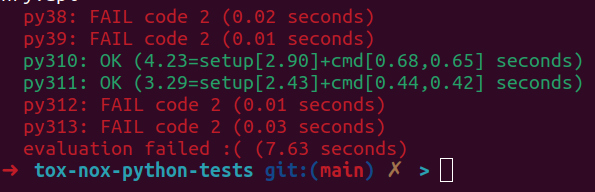
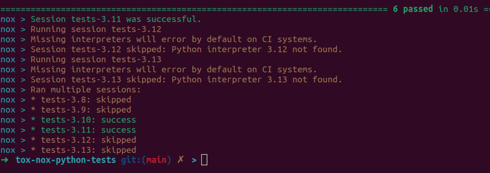

# Using Tox, Nox and CI/CD for Multiple Python Versions Validation Tests


This project demonstrates the integration of **Tox**, **Nox**, **Poetry**, **CI/CD** and **Pytest** to validate
Python projects across multiple Python versions. This is specially useful for shared libs projects
and multi-user environments projects.

## Features

- Example functions for addition and subtraction.
- Unit testing on tht with `pytest`.
- Dependency and environment management with `Poetry`.
- Multi-version Python application testing with `Tox`, `Nox` and `CI/CD` (Gitlab and GitHub Actions).

## Getting Started

### Clone the Repository

```bash
git clone https://github.com/wallaceespindola/tox-nox-python-tests.git
cd tox-nox-python-tests
```

### Install Poetry

```bash
pip install poetry
```

### Install Dependencies (listed in pyproject.toml)

```bash
poetry install
```

### Run Unit Tests

```bash
poetry run pytest --verbose
```

### Run Tox

```bash
poetry run tox
```

Example output:



### Run Nox

```bash
poetry run nox
```

Example output:



### References

This project was created to showcase how to validate Python projects across multiple Python versions using
Tox, Nox and CI/CD for automated testing, with dependency and environment management powered by Poetry.
It includes unit tests written with Pytest.
Here are some helpful references to understand the tools used in this project:

- [Tox Documentation](https://tox.wiki/en/).
- [Nox Documentation](https://nox.thea.codes/en/stable/).
- [Poetry Documentation](https://python-poetry.org/docs/).
- [Pytest Documentation](https://docs.pytest.org/en/stable/).
- [GitLab CI/CD Documentation](https://docs.gitlab.com/).
- [GitHub Actions CI/CD Documentation](https://docs.github.com/en/actions).

### Related Articles

- Dev.to: Test Python Code Like a Pro with Tox, Nox and CI/CD
- Dzone: Automating Python Multi-Version Testing with Tox, Nox and CI/CD

## Author

- Wallace Espindola, Sr. Software Engineer / Java & Python Dev
- E-mail: wallace.espindola@gmail.com
- LinkedIn: https://www.linkedin.com/in/wallaceespindola/
- Gravatar: https://gravatar.com/wallacese
- Website: https://wtechitsolutions.com/

## License

- This project is released under the MIT License. See the [LICENSE](LICENSE) file for details.
- Copyright © 2025 [Wallace Espindola](https://github.com/wallaceespindola/).
